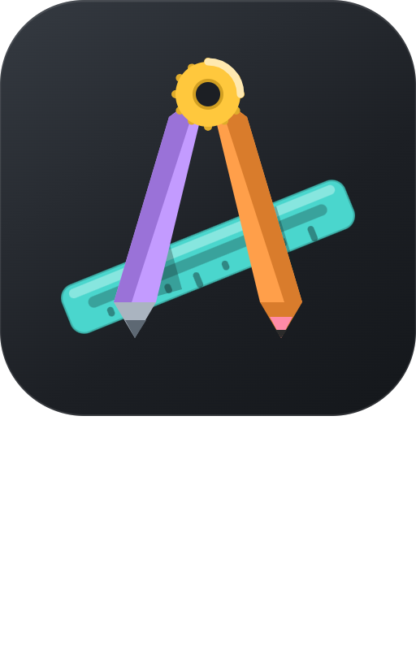
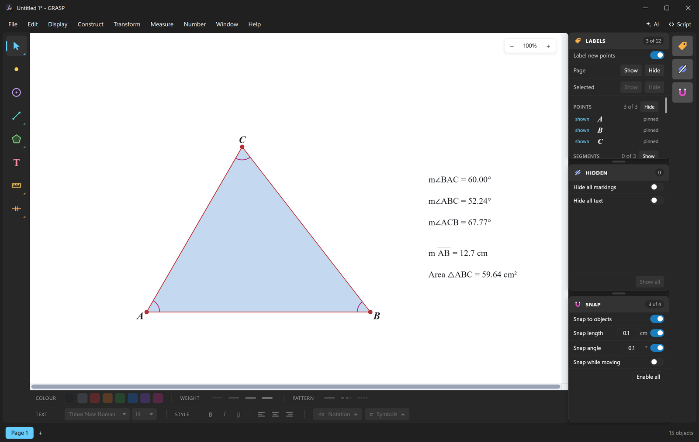
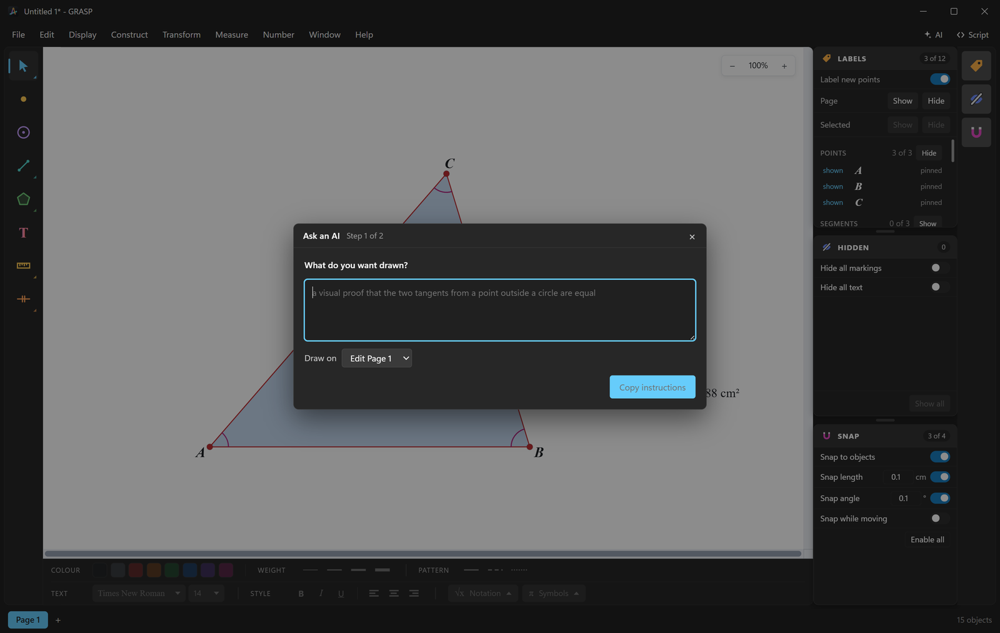

#  GRASP

**G**RASP **R**enders **A**ll **S**ketches **P**recisely.

A geometry sketchpad for the classroom. Draw accurate figures, measure them,
produce visual proofs. Help your students grasp geometric intuition.

Free, open source, and it runs in a browser: **[grasp-math.netlify.app](https://grasp-math.netlify.app)**

## Dynamic measurements

Drag one corner and every angle, length and area recalculates. Students can see
how each change affects the bigger picture of your geometry.

## Intuitive interface

Enjoy creating sketches with a user-first set of panels. Iterate rapidly with
keyboard shortcuts to activate the exact tool you need.

## Features

- **Construct.** Points, segments, rays, lines, circles, arcs and fills.
  Midpoints, intersections, parallels, perpendiculars, angle bisectors, points
  that slide along a path, and loci.
- **Transform.** Translate, rotate, dilate and reflect to create more advanced
  sketches.
- **Measure.** Keep track of lengths, areas, angles, ratios and more as you
  iterate your sketch.
- **Numbers.** Set parameters, do step-by-step calculations and watch them update.
- **Mark up.** Label sides of a polygon as equal, parallel, or add angle arcs for
  more polished classroom demos or for worksheet printing.
- **Export.** Export a selection or a page to an image file or to your clipboard.
  Optimise it for your printed worksheet or your colourful slideshow.

## AI-powered scripting

GRASP comes with a full scripting language that an AI model can figure out.
Generate complex proofs and sketches with minimal effort.

## Getting it

- **In a browser.** [grasp-math.netlify.app/launch](https://grasp-math.netlify.app/launch).
  Fully-featured on a desktop, and always available online. The same address works
  on a phone, laid out for a finger: two fingers move the sheet, a long press on a
  tool opens its variants, and a Share button hands the sketch to the device. The
  drawing and measuring tools are all there, so are the constructions, and so is
  asking an AI for a figure. The transform dialogs, the parameters and tables, the
  panels, the pages, image export and printing are not.
- **Windows.** Each [release](https://github.com/wpinrui/grasp/releases) carries
  a full installation of GRASP, or a portable executable file.
- **macOS and Linux.** Coming soon.

Building it yourself needs [yarn](https://yarnpkg.com): `yarn && yarn dev`.

## Acknowledgements

GRASP was built with [Claude Code](https://claude.com/claude-code). Claude wrote
most of the code and this page; the product decisions, the specification and the
review were mine.

## Licence

MIT. See [LICENSE](LICENSE).
